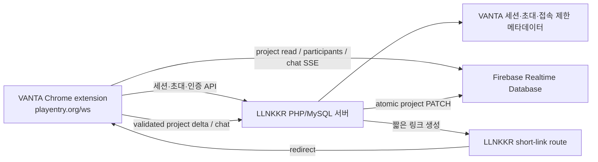

# VANTA 설계 초안

## 현재 구현 메모 (1.0.22)

- 원격 변경 강조와 관련 설정은 완전히 제거했다. 원격 작품 반영 중 엔트리 자체의 불필요한 전환 효과만 억제한다.
- 구름 설정 버튼은 패널을 부드럽게 아래로 확장해 최대 참여 인원(2~5명), 현재 Token 잔여율, 전체 단축 링크와 복사 버튼을 표시한다. 최대 인원 변경은 방 소유 설치만 가능하다.
- 커서는 LLNKKR DB의 제한된 요청/응답으로 동기화한다.

- 실시간 읽기·SSE는 LLNKKR가 발급한 방 전용 Firebase Custom Token과 Realtime Database REST API를 사용한다.
- 참가자 프로필, 최근 채팅 20개와 작품 변경 알림을 Firebase REST SSE 스트림으로 받는다.
- 작품은 ID 기반 조각으로 분리하며 실제 변경이 생긴 조각만 LLNKKR가 검증한 뒤 Firebase에 원자적 PATCH로 업로드한다.
- 참가자는 RTDB의 고정 슬롯 `0`~`4`를 사용해 서버 규칙에서 최대 5명을 강제한다.
- 참가자 임대는 5초 heartbeat와 45초 만료시간을 사용한다. 조각형 방은 프로토콜 3만 쓰게 해 구버전의 전체 덮어쓰기를 차단한다.
- LLNKKR은 세션 생성·빈 방 삭제·단축 링크와 작품 쓰기 검증을 담당하고, Firebase는 현재 조각과 실시간 스트림을 보관한다.
- 0.1.4부터 링크 복사는 LLNKKR 공개 단축 API를 사용하고, 같은 VANTA 토큰의 단축 결과를 로컬 캐시한다.
- 0.1.18부터 생성 제한은 설치당 하루 100개, IP당 하루 500개, IP당 5분 30개다. 마지막 참가자의 정상 종료 시 즉시 삭제하고, 비정상 종료 방은 참가자 임대가 끝난 뒤 LLNKKR의 분당 청소에서 삭제한다.
- 0.1.19부터 작품 객체를 JSON 문자열로 저장해 Firebase 경로에서 금지하는 문자가 엔트리 사용자 데이터의 키에 포함되어도 원본 필드를 바꾸지 않고 동기화한다.
- 0.1.20부터 Firebase 브라우저 인증 응답의 선택적 갱신 토큰에 의존하지 않고, 누락 시 방 인증을 다시 요청한다.
- 0.1.21부터 전체 프로젝트를 다시 적용하기 전후에 `Entry.Func` 메뉴 캐시와 변수/함수 팔레트 렌더링 캐시를 초기화해 인수 블록 중복을 막는다.
- 0.1.22부터 작품 저장을 1.8초 idle debounce와 8초 최대 대기 방식으로 제한하고, 드래그 중 저장을 미룬다. Firebase 쓰기 응답은 `print=silent`로 본문을 생략한다.
- 0.1.23부터 `If-Match` 조건부 작품 저장에는 Firebase가 허용하지 않는 `print=silent`를 붙이지 않고, presence 등 비조건부 쓰기에만 적용한다.
- 0.1.24부터 오브젝트·장면·변수·메시지·함수·테이블은 ID별 조각, 배열 순서와 나머지 최상위 필드는 manifest/필드 조각으로 저장한다. `Entry.do`는 변경 감지 신호로만 사용하며 원본 명령은 재생하지 않는다.
- 0.1.24의 조각 쓰기는 방·UID·participant·설치 ID에 묶인 LLNKKR `syncToken`으로 인증한다. 초기화는 최대 10MiB, delta는 최대 2MiB이며 변경 조각 개수·개별 크기와 분당 요청 수를 서버에서 제한한다.
- 0.1.26부터 참가자는 표시용 닉네임 첫 글자 프로필로 보이며 본인이 첫 번째다.
- 0.1.27부터 원격 변경 영역 강조는 완전히 제거한다. 원격 작품을 다시 조립해 불러오는 동안에는 엔트리의 전환·확대 애니메이션을 잠시 억제해 오브젝트 UI가 순간적으로 커졌다 작아지는 현상을 줄인다.
- 채팅 전송 버튼은 위 화살표 대신 종이비행기 아이콘을 사용한다.
- 0.1.28부터 Live 참가 등록 전에 실제 엔트리 닉네임이 DOM에 나타날 때까지 기다려 임시 `참여자` 이름을 등록하지 않는다.
- 참여자 목록은 항상 노출하지 않는다. 패널 오른쪽의 참여자 아이콘을 누르면 검은색 프로필 트레이가 오른쪽으로 펼쳐지고, 개별 프로필 확장 시에는 닉네임만 여백 없이 표시한다.
- 0.1.29부터 검은 프로필 트레이가 참여자 아이콘까지 감싸고 컨테이너 전체가 넓어진다. 프로필 목록 자체의 중첩 배경은 투명하게 두어 진한 파란색처럼 보이는 이중 배경을 없앤다.
- 0.1.30부터 개별 프로필을 펼치면 첫 글자의 고정 칸을 실제 글자 폭으로 줄여 나머지 닉네임과 바로 붙이고, 측정한 전체 닉네임 폭에 좌우 `8px` 패딩을 동일하게 더한다.
- 0.1.31부터 참여자 컨테이너는 VANTA 패널과 같은 배경 변수·테두리·12px 라운드·그림자·블러를 사용하고, 참여자 아이콘 버튼은 투명 배경으로 표시한다.
- 0.1.32부터 VANTA 패널과 참여자 컨테이너는 같은 `40px` 높이 변수를 사용한다. 채팅은 화면 아래에서 위로 올라와 열리고, 닫힐 때 아래로 완전히 내려간 뒤 DOM 표시를 끈다.
- 0.1.33부터 VANTA 패널을 접으면 참여자 목록 상태도 닫고, 참여자 아이콘을 포함한 컨테이너 전체가 패널 방향으로 이동·축소·페이드된 뒤 숨는다.
- 0.1.34부터 공유하기 버튼은 Material Sensors 아이콘을 사용한다. LLNKKR 세션·동기화·채팅 API는 정확한 최신 확장 버전 헤더를 요구하고, release 34를 HMAC/Custom Token에 서명해 Firebase 읽기·참여에도 같은 릴리스를 강제한다.
- 0.1.35부터 IP별 하루 100토큰(1토큰=예상 다운로드 1MiB)을 기본으로 집계하며, `/vanta777`에서 지급·압수·정지·한도 변경을 관리한다. 사용자 클라이언트는 30초마다 서명된 연결 사용량을 보고한다.
- 0.1.37부터 패널의 Token 아이콘이 현재 IP의 남은 비율을 보여준다. 집계 기준은 기본 주간이며 `/vanta777`에서 일간·주간·월간으로 즉시 전환한다.
- 0.1.38부터 Token 버튼은 Cloud 아이콘을 사용하고, 잔여율은 정수로 표시하며, 펼친 문구의 좌우 여백과 다른 아이콘 사이 간격을 동일하게 맞춘다.
- 0.1.39에서 manifest의 깨진 확장 프로그램 설명을 `궁극의 엔트리 VANTA Live`로 복구한다.
- 1.0.0에서 첫 정식 배포 버전 번호와 서버 release 40을 사용한다.
- 1.0.1에서 원본 엔트리 작품 주소/ID 메타데이터 전송을 제거하고, `vanta` 방 코드가 있는 `/ws`에서는 패널을 펼친 상태로 시작한다.
- 1.0.2에서 LLNKKR DB의 참여자별 단일 행으로 포인터를 동기화하고, 장면·오브젝트·상세 탭 위치를 원격 반영 후 복원한다.
- 1.0.3에서 엔트리 코드 보드(`entryBoardWrapper`)를 무대와 분리하고 영역별 상대 좌표를 사용하며 참여 인원 수를 항상 표시한다.
- 1.0.4에서 코드 보드 포인터는 SVG 작업 좌표를 범위 제한된 값으로 인코딩하고, 수신자의 코드 보드 확대 배율로 복원한다. 원격 포인터는 원형이며 활성 이동은 최대 약 35ms 간격으로 전송한다.
- 1.0.5에서 포인터 이동 전송과 원격 좌표 확인을 분리한다. 이동은 최대 25ms, 수신 확인은 최대 40ms 간격이며, 정지 중 확인은 좌표 행을 다시 쓰지 않고 1초마다 유지 갱신만 한다.
- 1.0.6에서 생성 패널의 `isOpen` 상태도 로컬 인터페이스 편집으로 취급한다. 포인터에는 현재 장면·오브젝트의 짧은 비식별 키를 포함하고, 다른 작업 위치의 포인터는 반투명 처리하며 좌표 샘플 사이를 연속 보간한다.
- 1.0.7에서 코드 보드 포인터 좌표는 첫 유효 블록의 비식별 키와 블록 기준 오프셋으로 저장한다. 수신자는 같은 블록의 로컬 화면 위치를 기준으로 복원하므로 서로 다른 스크롤 시점을 보정한다.
- 1.0.8에서 포인터 영역 또는 코드 보드 기준 블록이 바뀌면 이전 렌더링 위치를 새 좌표계의 시작값으로 역변환한다. 따라서 좌표계 전환도 하나의 연속 이동으로 처리한다.
- 1.0.9에서 원격 변경 글리치와 설정 패널의 첫 구조를 시험했다.
- 1.0.10에서 별도 Token 버튼을 제거하고 구름 설정 버튼으로 통합했으며, Live 시작 전에도 다음 방의 최대 인원을 선택할 수 있게 했다.
- 1.0.12에서 Fast 커서를 완전히 제거하고 일반 LLNKKR 커서만 유지했다. 설정이 열린 동안 Live·비-Live 상단 동작 버튼을 우측 정렬하고, Live 시작 전 공유 처리 중에는 금지 커서를 표시한다.
- 1.0.13에서 로컬 익명 모드와 프로필·포인터 공용 HEX 색상 설정을 추가했다. 서버는 IP별 미인증 닉네임 이력을 중복 없이 기록하고, Live 종료 시 작품 저장 안내를 표시한다.
- 1.0.14에서 사용자 색상 밝기에 따라 닉네임 글자색을 자동 선택하고 복사 체크 아이콘의 종횡비를 고정했다. 코드 보드 포인터는 SVG 화면 변환 행렬로 좌표를 변환해 화면 이동·확대와 일정한 Y 오차를 함께 보정한다.
- 1.0.15에서 설정 내 단축 링크 복사 버튼은 공통 30px 아이콘 규칙보다 우선하는 정사각형 크기를 사용한다.
- 1.0.16에서 `entryBoard` 커서는 보드 전체가 아닌 가장 가까운 블록의 안정적인 해시 ID와 SVG 변환 행렬을 기준으로 좌표를 변환한다. 서로 다른 화면 비율, 보드 패닝, 확대율에서도 같은 블록 기준 위치를 복원한다.
- 1.0.17에서 블록 기준점 키는 브라우저별 랜덤 DOM ID 대신 최상위 스크립트 순서와 그 안의 블록 순서를 해시한다. 동일 작품을 연 Chrome·Opera에서 블록 DOM ID가 달라도 구조 키는 일치한다.
- 1.0.24에서 이전 전체 작품 동기화와 `syncVersion 1` 스트림을 제거한 구조를 유지하며, 확장 프로그램·LLNKKR·Sync/Cursor Firebase는 release 53만 허용한다. Fast 커서는 방장이 변경하는 방 전체 설정으로 동작한다.
- `/ws` 작업 화면에 처음 진입했을 때 VANTA 패널은 접힌 상태로 시작하며 사용자가 로고를 눌러 펼친다.
- 채팅은 최대 100자·3줄, 활성 방의 최근 20개만 유지한다. LLNKKR가 참가자당 1초 1개·1분 20개·10분 100개 제한을 적용하고 Cursor Firebase의 20개 고정 슬롯 중 한 메시지 조각만 교체한다.

작성일: 2026-08-12
상태: LLNKKR/Firebase 운영 연동 및 Chrome·Opera 실동작 검증 완료

## 1. 목표와 경계

VANTA는 `https://playentry.org/ws/...`에서만 동작하는 크롬 확장 프로그램이다. 협업 세션 자체는 항상 `https://playentry.org/ws/new?...&vanta=...`에서만 유지한다. 엔트리의 기존 저장 기능을 대체하거나 막지 않는다. VANTA는 공유를 시작한 뒤 다음을 제공한다.

VANTA 패널은 제공된 SVG 워드마크를 사용하고, 기본 브랜드 컬러를 `#7351FF`로 통일한다. 패널을 접었을 때는 워드마크만 수평·수직 중앙에 남는다.

- 추측하기 어려운 초대 링크로 참여하는 실시간 공동 편집 세션
- 참가자 프로필과 최근 20개 실시간 채팅
- 엔트리 작품 데이터의 실시간 동기화 및 서버 스냅샷 보관
- LLNKKR 단축 링크를 통한 공유 링크 복사

엔트리 닉네임이나 엔트리 로그인 계정을 VANTA의 권한 기준으로 사용하지 않는다. 초대 링크의 비밀값을 가진 사람이 참여할 수 있는 capability-link 방식으로 시작한다. 링크가 유출되면 접근 권한도 함께 유출되므로, 이후에는 링크 폐기와 재발급 기능을 반드시 제공한다.

엔트리 화면에서 읽은 닉네임은 참가자 프로필과 채팅의 표시 이름으로만 사용한다. 인증·권한·참가자 식별에는 사용하지 않으며, 실제 식별자는 VANTA가 생성한 `participant_id`를 유지한다. 닉네임은 제어문자와 불필요한 공백을 제거하고 길이를 제한한 뒤 `textContent`로만 렌더링한다.

VANTA가 **하지 않는 것**:

- `playentry.org/project/...` 공개 작품 페이지에서 동작
- 엔트리 서버의 공개/저장/좋아요/댓글/작성자 권한을 변경
- 엔트리의 작업 화면 DOM을 통째로 저장하거나 동기화
- 실행 중인 작품의 순간 변수값을 공동 편집 데이터로 취급

## 2. 실제 조사 결과

### 2.1 엔트리 WS 화면

현재 열려 있는 `playentry.org/ws/<id>` 편집 화면에는 파일 메뉴와 저장 버튼이 있으며, 캔버스·블록 작업 영역·오브젝트/그림/소리/변수 탭이 한 화면에 존재한다. 전역 `window.Entry` 객체는 직접 노출되지 않았으므로, 확장 프로그램은 특정 전역 객체 하나에 의존하지 말고 실제 데이터 변경 경로를 별도로 탐색해야 한다.

이 점은 중요하다. VANTA의 동기화 기준은 화면 HTML이 아니라 엔트리가 내보내는 작품 모델이어야 하며, 엔트리 내부 구현이 바뀌면 어댑터를 갱신할 수 있도록 분리해야 한다.

엔트리 함수 편집기는 `Entry.Func.isEdit` 동안 별도의 오버레이 작업판을 사용한다. 이 상태에서 전체 프로젝트를 `clearProject()` 후 다시 불러오면 편집 중인 함수 참조가 사라질 수 있으므로, VANTA는 함수 편집이 끝날 때까지 내보내기와 원격 변경 적용을 보류한다. 같은 함수를 동시에 수정한 경우 마지막 함수 조각을 우선하며, 함수 내부 블록 단위 병합은 아직 하지 않는다.

### 2.2 `.ent` 파일

로컬의 실제 `.ent` 샘플을 확인한 결과, `.ent`는 tar 호환 아카이브였다. 최상위에는 임시 경로 아래 다음이 들어 있었다.

```text
temp/<작업-식별자>/project.json
temp/<작업-식별자>/image/*.png
temp/<작업-식별자>/thumb/*.png
temp/<작업-식별자>/sound/*.mp3
```

조사한 샘플 하나는 총 66개 항목으로 구성되었고, `project.json` 1개, 이미지 16개, 썸네일 16개, 소리 8개를 포함했다. 해당 `project.json`에는 5개 오브젝트, 2개 장면, 20개 변수, 2개 메시지, 12개 함수가 있었다.

`project.json`의 최상위 주요 항목:

```text
objects, scenes, variables, messages, functions, tables,
speed, interface, expansionBlocks, aiUtilizeBlocks,
hardwareLiteBlocks, externalModules, externalModulesLite,
likeCnt, visit, isopen, name, isPracticalCourse,
recentLikeCnt, childCnt, comment
```

오브젝트에는 위치·회전·크기·보임 여부 등의 `entity`, 그림/소리 자산 메타데이터, 그리고 블록 트리를 JSON 문자열로 담은 `script`가 포함된다. 따라서 **프로젝트 JSON + 참조 자산**이 VANTA가 보관해야 할 작품 상태의 상한선이다.

## 3. 저장할 데이터의 구분

| 구분 | 예시 | 저장/동기화 방식 |
| --- | --- | --- |
| 작품의 기준 상태 | 오브젝트, 블록 스크립트, 장면, 변수, 함수, 설정 | 서버 스냅샷과 변경 연산으로 보관 |
| 작품 자산 | PNG, 썸네일, MP3 | SHA-256 해시로 중복 제거 후 별도 업로드 |
| 협업 임시 상태 | 표시용 이름, 접속 여부, 최근 채팅 20개 | Firebase Realtime Database에서 방이 활성인 동안 유지 |
| 개인 UI 상태 | 열어 둔 탭, 패널 크기, 확대/이동 위치 | 각 브라우저 로컬에만 보관 |
| 실행 중 상태 | 작품 실행 중 생긴 값, 타이머, 무대 결과 | VANTA 편집 동기화 대상에서 제외 |

참여자와 채팅은 작품 revision과 분리한다. 채팅이 작품 저장을 깨우거나 작품 delta 순서를 바꾸지 않으며, 방 삭제 시 함께 제거된다.

## 4. URL 문제: VANTA는 항상 `/ws/new`에서만 협업한다

기존 엔트리 작품 URL의 ID는 VANTA 협업 문서 ID로 쓰지 않는다. VANTA 공유는 기존 작품을 엔트리에서 리메이크하거나 저장하는 작업이 아니라, 현재 작품 상태를 VANTA 서버로 복제(fork)하는 작업이다.

| 공유를 누른 위치 | VANTA의 처리 | 공유 뒤 실제 협업 URL |
| --- | --- | --- |
| `/ws/new?...` | 현재 빈/미저장 작품 상태를 VANTA 세션의 첫 스냅샷으로 저장 | `/ws/new?...&vanta=<초대코드>` |
| `/ws/<내-작품-id>?...` | 현재 작품 상태를 서버에 복제하고 원래 엔트리 ID는 출처로만 기록 | `/ws/new?...&vanta=<초대코드>` |
| `/ws/<원작-id>?...` 리메이크 상태 | 현재 리메이크 편집 상태를 서버에 복제하고 원작 ID는 출처로만 기록 | `/ws/new?...&vanta=<초대코드>` |
| 초대 링크 방문 | 서버 스냅샷을 빈 엔트리 편집기에 적용하고 실시간 동기화 시작 | `/ws/new?...&vanta=<초대코드>` |

### 핵심 규칙

1. VANTA 세션은 공유 버튼을 누를 때 LLNKKR 서버에서 새로 만든다.
2. 세션의 영구 키 `vanta_session_id`는 엔트리 URL ID와 전혀 다른 UUID/랜덤 식별자다.
3. 기존 작품에서 공유를 누르면, 확장 프로그램은 먼저 현재 작품 모델과 자산을 VANTA 서버에 첫 스냅샷으로 저장한 뒤 `/ws/new?...&vanta=...`로 이동한다.
4. 기존 URL의 ID는 `source_entry_project_id`로만 기록한다. 이 값만으로 기존 VANTA 세션에 자동 접속하면 안 된다.
5. 협업 중 엔트리 기본 저장을 사용하면 이를 막지 않는다. 엔트리가 `/ws/<새-id>`로 URL을 바꾸는 순간 VANTA는 동기화를 종료하고, "엔트리 작품으로 저장되어 공유 세션에서 나갔습니다"라고 알린다.
6. 초대받은 사람은 원본 작품 주소가 아니라 `vanta` 초대 코드가 붙은 `/ws/new` 주소로 입장한다.

이 구조는 원작을 리메이크한 서로 다른 사람들이 원작 ID만 같다는 이유로 같은 협업방에 합류하는 문제와, 비공개 엔트리 작품을 엔트리 서버에 다시 저장해야 하는 문제를 모두 없앤다.

### 권장 세션/출처 모델

```text
vanta_sessions
  id                    VANTA의 영구 세션 ID
  owner_device_id       공유를 만든 확장 프로그램 설치 ID
  source_entry_id       공유를 시작한 원본/리메이크 출처 ID (없을 수 있음)
  entry_mode             new | copied-from-entry
  state                 draft | active | closed

vanta_entry_bindings
  vanta_session_id
  entry_project_id
  binding_kind          shared-from-new | copied-from-entry | copied-from-remix
  observed_at

vanta_invites
  vanta_session_id
  token_hash            원문 대신 해시만 저장
  role                  editor | viewer
  expires_at / revoked_at
```

협업 중 저장으로 `/ws/new`를 벗어나면 VANTA의 해당 탭 세션은 끝난다. URL 변화는 확장 프로그램이 감지하며, 엔트리의 새 작품 ID를 VANTA 세션에 재연결하지 않는다.

## 5. 공유 링크 설계

공유 버튼은 다음 순서로 동작한다.

1. 확장 프로그램이 현재 URL과 작품 상태를 읽고, 기존 작품이면 출처 엔트리 ID를 기록한다.
2. 현재 작품 모델과 자산을 VANTA 세션의 첫 스냅샷으로 업로드한다.
3. LLNKKR 서버가 VANTA 세션과 256비트 이상의 초대 비밀값을 생성한다. DB에는 초대값 원문 대신 해시만 저장한다.
4. 확장 프로그램은 현재 탭을 빈 작업 공간인 `/ws/new?...&vanta=<초대코드>`로 이동시킨다.
5. 새 작업 공간의 VANTA가 서버 스냅샷을 적용한 후 실시간 동기화를 시작한다.
6. LLNKKR의 짧은 코드가 만들어지고 클립보드에는 짧은 링크를 복사한다.
7. 이후 엔트리의 기본 저장을 누르면 막지 않으며, URL이 `/ws/<id>`로 바뀌면 VANTA 동기화를 종료한다.

```text
https://playentry.org/ws/<현재-id 또는 new>?type=normal&mode=block&lang=ko&vanta=<불투명-초대코드>
```

`vanta` 값은 사람에게 의미 있는 방 이름이 아니라 충분히 긴 비밀값 또는 그와 동등한 단기 교환 코드여야 한다. 로그, 분석 도구, 브라우저 방문 기록에 URL이 남을 수 있으므로 MVP 뒤에는 단기 코드 교환과 링크 폐기 기능을 추가한다.

## 6. 서버 구성



### LLNKKR 서버가 맡을 일

- 세션 생성, 초대 코드 검증, 링크 폐기
- 엔트리 ID 바인딩과 리메이크 출처 기록
- 작품 초기화·delta의 인증, 크기·개수·요청 빈도 검증
- 채팅 인증, 도배 제한, Cursor Firebase 최근 20개 슬롯 교체
- 자산 해시·업로드 권한·보존 기간 관리
- 기존 LLNKKR 단축 링크 생성 및 리다이렉트

LLNKKR의 현재 PHP/MySQL 구조를 확장한다. 접속 정보는 로컬/서버의 비공개 설정 파일에서만 사용하며, 확장 프로그램·저장소·문서에 넣지 않는다.

### Firebase가 맡을 일

- 현재 접속한 참여자 목록
- 참가자 표시 이름·색·접속 임대
- 최근 채팅 20개와 실시간 변경 이벤트
- 현재 작품 조각과 원자적 revision
- 최신 변경 조각을 알리는 SSE 스트림

이 범위는 Firebase Spark 무료 플랜으로 시작할 수 있다. Blaze나 결제 수단 연결은 지금 필요 없다. LLNKKR가 유효한 참가자에게 방·participant·프로토콜 claim이 든 Firebase 토큰과 별도의 서명된 쓰기 토큰을 발급한다. RTDB 규칙은 활성 5개 슬롯이 있는 사용자만 작품·채팅 스트림을 읽게 하고, 조각 작품과 채팅 쓰기는 LLNKKR 서버 토큰만 허용한다.

## 7. 작품 동기화 방식

### 현재 — ID 조각 상태 동기화

`Entry.exportProject()` 결과를 다음 단위로 나눈다.

```text
manifest                         배열 순서와 조각 참조
item_objects_<id>                오브젝트 전체(내부 script 포함)
item_scenes_<id>                 장면 하나
item_variables_<id>              변수 하나
item_messages_<id>               신호 하나
item_functions_<id>              함수 전체(내부 content 포함)
item_tables_<id>                 테이블 하나
field_<name>                     그 밖의 최상위 필드
```

로컬 변경 뒤에는 이전 조각과 비교해 `set`/`remove` delta를 만든다. LLNKKR는 활성 참가자와 제한을 검증한 뒤 Firebase `revision`, 작은 최신 변경 헤더, 실제 변경 조각을 한 번의 multi-location PATCH로 갱신한다. SSE revision이 건너뛰거나 delta 검증·재조립에 실패하면 그때만 현재 조각 전체를 다시 읽는다.

서로 다른 ID 조각의 동시 변경은 자연스럽게 합쳐진다. 두 사용자가 동시에 새 ID를 추가해 마지막 manifest에 한쪽 ID가 빠져도, 유효한 미참조 item 조각을 안정된 순서로 끝에 붙여 둘 다 보존한다. 명시적인 chunk 제거만 삭제로 인정한다. 같은 오브젝트나 함수 조각을 동시에 바꾸면 마지막 도착 변경이 우선한다. 수신 측은 엔트리 내부 컬렉션 API로 조각을 직접 끼워 넣지 않고, 메모리에서 완전한 프로젝트를 재구성한 뒤 검증된 전체 가져오기 경로를 사용한다.

`Entry.commander.doEvent`와 `Entry.creationChangedEvent`는 저장 검사를 빠르게 시작하는 힌트다. 원본 `Entry.do` 인수에는 라이브 블록·보드·DOM 객체와 현재 UI 상태가 섞일 수 있으므로 직렬화하거나 원격 재생하지 않는다.

### 다음 — 블록 단위 충돌 해결

함수 `content`와 오브젝트 `script` 내부를 블록 ID/부모 슬롯 기준 연산으로 나누면 같은 함수·오브젝트 안의 서로 다른 블록도 병합할 수 있다. 이 단계에는 전용 allowlist, operation ID, base hash, undo 격리와 충돌 UI가 필요하며 raw `Entry.do` 전달로 대체하지 않는다.

### 자산

이미지·소리는 바이트의 SHA-256을 키로 하여 한 번만 업로드한다. `project.json`에는 자산 ID/파일명/크기/형식만 남긴다. 썸네일은 원본 이미지에서 재생성 가능한지 실험 뒤 보관 정책을 정한다.

## 8. 확장 프로그램 구조

```text
05-VANTA/
  extension/
    manifest.json
    content/entry-adapter.js       엔트리 WS 상태 읽기/적용 어댑터
    content/vanta-panel.js         공유·접속자·충돌 UI
    background/service-worker.js   링크, 인증, 재시도, 메시지 중계
    shared/project-normalizer.js   해시·정규화·차이 계산
  server/
    api/vanta/                     LLNKKR에 올릴 PHP API
    migrations/                    VANTA 테이블
  DESIGN.md
```

권한은 처음부터 최소화한다.

- `host_permissions`: `https://playentry.org/ws/*`, LLNKKR API 도메인, Firebase 프로젝트 도메인만
- `permissions`: `storage`, `clipboardWrite` 등 실제 기능에 필요한 것만
- `content_scripts`: WS 주소에서만 주입

## 9. 먼저 해야 할 검증 실험

| 순서 | 실험 | 확인할 것 |
| --- | --- | --- |
| 1 | 내 저장 작품을 `.ent`로 내려받기 | 파일 목록과 `project.json`의 기준 구조 |
| 2 | 오브젝트/블록/변수/그림/소리를 하나씩 변경한 뒤 다시 내려받기 | 어떤 JSON 필드와 자산 파일이 바뀌는지 |
| 3 | `/ws/new`에서 공유 | 첫 스냅샷을 저장하고 `vanta`가 붙은 새 작업 공간을 여는지 |
| 4 | 공개/비공개 작품 또는 리메이크 상태에서 공유 | 엔트리 저장 없이 현재 상태를 복제한 뒤 `/ws/new`로 이동하는지 |
| 5 | VANTA 협업 중 엔트리 기본 저장 | 저장은 정상 동작하고 URL 변경 즉시 VANTA 동기화만 끝나는지 |
| 6 | 두 브라우저 프로필로 같은 초대 링크 접속 | 참가자·채팅·스냅샷 수신, 잘못된 초대 링크 거부 |

## 10. 다음 구현 순서

1. 엔트리에서 안전하게 `.ent`를 내려받는 경로와 작품 모델을 읽는 방법을 확정한다.
2. VANTA 패널에 "공유하기"를 만들고, 첫 스냅샷 업로드 후 `/ws/new?vanta=...`로 안전하게 이동시킨다.
3. LLNKKR에 세션·초대·바인딩 API와 DB 마이그레이션을 추가한다.
4. Firebase 인증/규칙과 참가자 presence를 연결한다.
5. 단일 사용자 스냅샷 저장·복구를 만든다.
6. 두 사용자 스냅샷 동기화, 이어서 연산 단위 동기화로 확장한다.

## 11. 현재 결정

- 중앙 권한/저장 서버: 기존 LLNKKR 서버
- 짧은 공유 링크: 기존 LLNKKR 링크 기능을 확장
- 실시간 참가자·최근 채팅·접속 상태: Firebase RTDB
- Firebase 결제/Blaze: 현재 불필요
- 엔트리 URL ID: 공유의 출처 정보일 뿐, VANTA 협업방 ID나 협업 URL로 사용하지 않음
- 첫 구현 우선순위: URL 수명주기와 `.ent` 기반 스냅샷 호환성 검증
